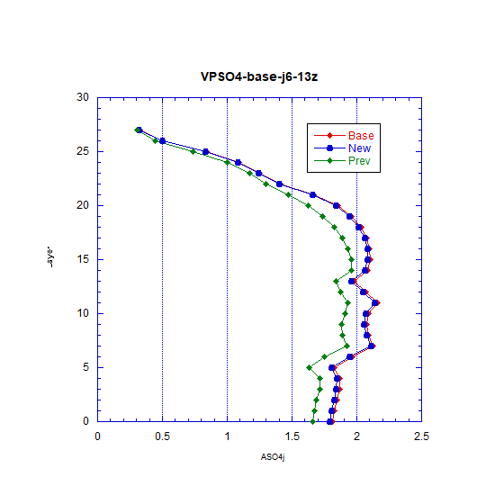

# Changed ACM cloud model to use Z-coordinates

**Author/P.O.C.:** [Jonathan Pleim](mailto:pleim.jon@epa.gov), Computational Exposure Division, U.S. EPA

## Brief Description

Changed ACM cloud model to use Z-coordinates rather than sigma-coordinates as in the preveous model.  This makes the ACM cloud model compatable with the new hybrid vertical coordinate that is the default in WRF starting with version 4.0.  

## Significance and Impact
Without this change the ACM cloud model would be in error when using hybrid vertical coordinates.  The revised code conserves mass and results are very slightly different from the preveous version using sigma-coordinates with terrain following vertical coordinates (see Figure 1).  The small difference is due to a revised calculation of air density that includes the effect of humidity. While the New code gives almost the same results as the Base code for terrain following coordinates, larger differences are expected for hybrid coordinates. 

Figure 1: Vertical profiles of ASO4j on June 6, 2011 at 13Z.  Base is CMAQv5.2.1 and New is CMAQv5.3 (Prev is a previous sensitivity simulation that had an error that effected mass conservation).    

## Affected Files
CCTM/src/cloud/acm_ae6/acmcld.f

CCTM/src/cloud/acm_ae6/convcld_acm.F

## References
## Internal Records:
#### Relevant Pull Requests:
[PR #354](https://github.com/USEPA/CMAQ_Dev/pull/354)
